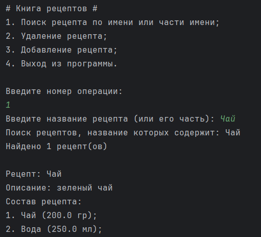
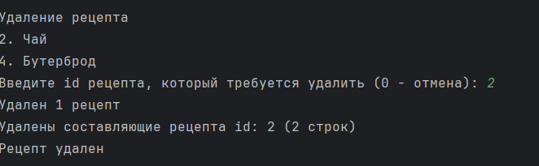
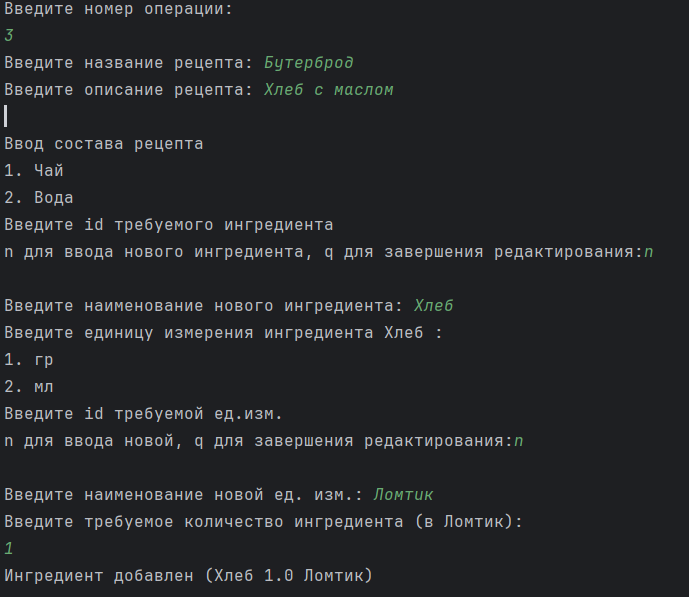
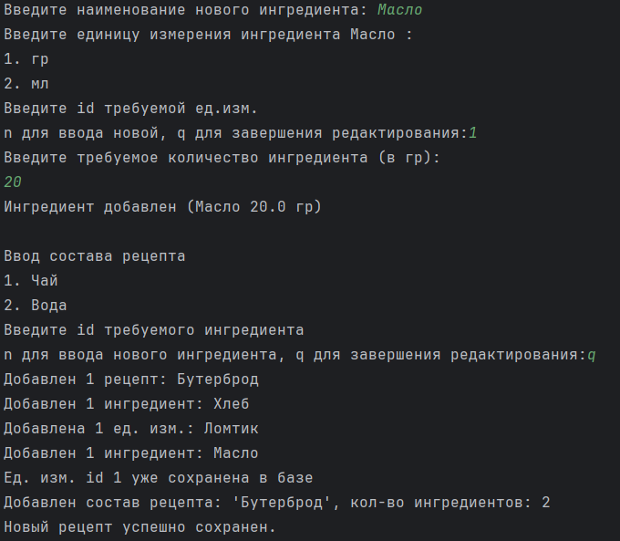

# Lesson 18 #
### Задание ###
Разработать консольное приложение для хранения рецептов.

Функциональность:

1 Поиск рецепта по имени или части имени блюда

2 Добавление рецепта - рецепт состоит из множества ингредиентов и их
количественного состава

3 Удаление блюда

### Реализация: ###

 